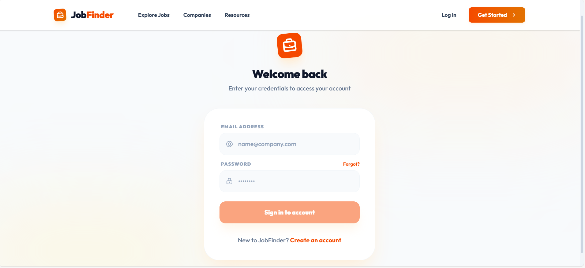
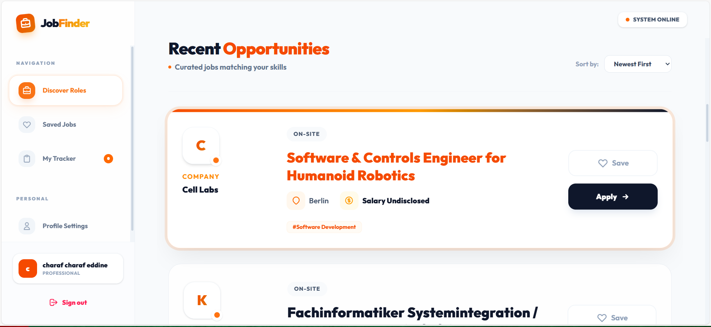
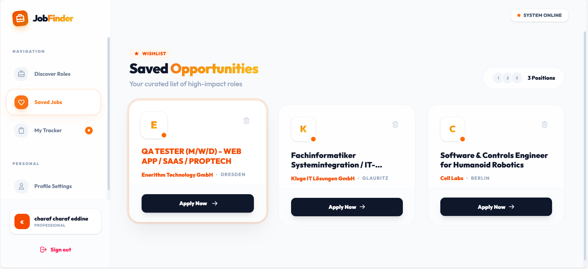
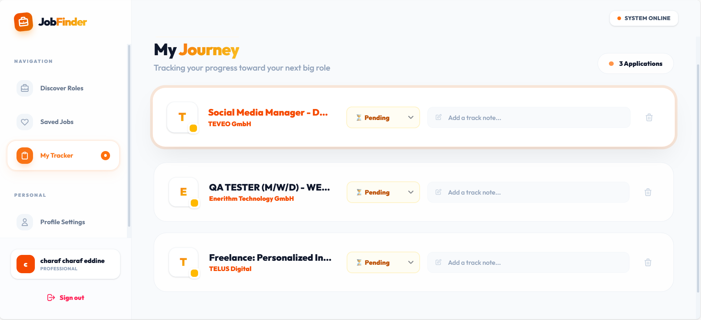
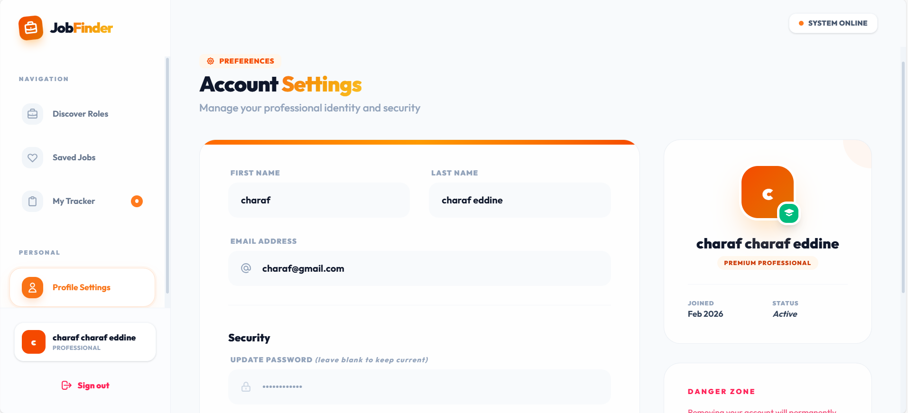

# 🚀 JobFinder - Application de Recherche d'Emploi








## 📖 Description

**JobFinder** est une plateforme moderne de recherche d'emploi développée en **Angular 17+ (Standalone Components)**. Conçue comme une **Single Page Application (SPA)**, elle offre une expérience utilisateur fluide et responsive pour les chercheurs d'emploi.

L'application permet aux utilisateurs de parcourir des offres agrégées depuis des APIs publiques, de gérer leurs favoris, de suivre l'état de leurs candidatures et de personnaliser leur profil professionnel.

Le backend est simulé à l'aide de **JSON Server**, permettant une persistance des données (utilisateurs, favoris, candidatures) et une authentification fonctionnelle côté frontend.

---

## ✨ Fonctionnalités Principales

### 🔍 Recherche Avancée
- **Recherche par Mots-clés** : Filtrage strict sur les titres de poste.
- **Filtrage Géographique** : Recherche par ville ou pays.
- **Tri Intelligent** : Résultats triés par date de publication (du plus récent au plus ancien).
- **Pagination** : Navigation fluide avec 10 résultats par page.

### 👤 Espace Utilisateur
- **Authentification** : Inscription et connexion sécurisées (Email/Mot de passe).
- **Profil** : Gestion des informations personnelles (Nom, Prénom, Email).
- **Suppression de Compte** : Option "Danger Zone" pour supprimer définitivement le compte et les données associées.

### ❤️ Gestion des Favoris (NgRx)
- Sauvegarde des offres intéressantes.
- Visualisation centralisée des favoris.
- Indicateurs visuels pour les offres déjà sauvegardées.
- **State Management** : Gestion optimisée avec NgRx Store & Effects.

### 📊 Suivi des Candidatures (NgRx)
- Ajout d'offres au tableau de bord de suivi.
- **Gestion de Statut** : Mises à jour en temps réel (En attente, Accepté, Refusé).
- **Notes Personnelles** : Ajout de notes pour chaque candidature (ex: "Entretien prévu le 10/03").

---

## 🛠️ Architecture Technique

Le projet suit une architecture modulaire et scalable basée sur les meilleures pratiques Angular :

```
src/app/
├── core/               # Services singleton, Guards, Interceptors, Modèles
│   ├── auth/           # Service d'authentification et Guard
│   ├── interceptors/   # Intercepteurs HTTP
│   ├── models/         # Interfaces TypeScript (User, Job, Application...)
│   └── services/       # Services métier (JobService, FavoriteService...)
├── features/           # Modules fonctionnels (Components)
│   ├── auth/           # Login, Register
│   ├── dashboard/      # Espace utilisateur (Favorites, Applications, Profile)
│   └── jobs/           # Recherche et liste des offres
├── store/              # Gestion d'état NgRx
│   ├── applications/   # Actions, Reducers, Effects, Selectors pour Candidatures
│   └── favorites/      # Actions, Reducers, Effects, Selectors pour Favoris
└── shared/             # Composants et pipes réutilisables (si applicable)
```

---

## 🚀 Installation et Démarrage

Prérequis : Node.js (v18+) et npm.

1. **Cloner le projet**
   ```bash
   git clone https://github.com/votre-username/JobFinder.git
   cd JobFinder
   ```

2. **Installer les dépendances**
   ```bash
   npm install
   ```

3. **Lancer le Serveur de Données (JSON Server)**
   Ce serveur simule l'API backend sur le port 3000.
   ```bash
   npm run server
   ```

4. **Lancer l'Application (Frontend)**
   Ouvrez un nouveau terminal et lancez le serveur de développement Angular.
   ```bash
   npm start
   ```
   L'application sera accessible sur `http://localhost:4200`.

---

## 🧪 Scénarios de Test

Pour valider les fonctionnalités lors de la soutenance :

1. **Recherche** : Tapez "Angular" dans la barre de recherche. Vérifiez que seuls les titres contenant "Angular" s'affichent.
2. **Favoris** : Connectez-vous, ajoutez une offre aux favoris. Allez dans le Dashboard > Favoris pour vérifier sa présence.
3. **Candidature** : Postulez à une offre. Allez dans Dashboard > Applications. Changez le statut à "Accepted" et ajoutez une note. Actualisez la page pour confirmer la persistance.
4. **Profil** : Modifiez votre nom dans l'onglet Profil.
5. **Pagination** : Vérifiez que la liste des offres affiche bien 10 éléments par page et que les boutons "Suivant/Précédent" fonctionnent.

---

## 👨‍💻 Auteurs

Projet réalisé dans le cadre de la soutenance croisée 2 (2025/2026).

---

*Made with ❤️ and Angular.*
